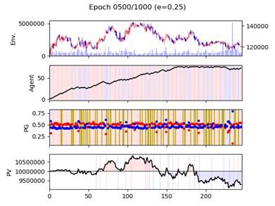

# 파이썬과 케라스를 이용한 강화학습 주식투자

## RL을 사용한 주식투자 구조

- Agent : 투자자
- Environment : (한 종목의) 차트 데이터
  - 2차원 데이터로 체결일(date), 시가(open), 고가(high), 저가(low), 종가(close), 거래량(volume)이 연속되는 식으로 구성된 데이터
- State
  - 주식 보유 비율 (현재 보유 주식 수 / 최대 보유 가능 주식 수)
  - 포트폴리오 가치 비율 (현재 포트폴리오 가치 / 기준 포트폴리오 가치)
- Action : 매수, 매도, 관망
- Reward : 손익

## RLTrader 구조

## Environment Setting

- Ubuntu 16.04.6
- Anaconda 4.5.4
- Python 3.5
- Keras 2.0.8
- https://nagy.tistory.com/26 아나콘다 설치 참조

`conda create -n <virtual_environment_name> tensorflow-gpu=1.15`

- Anaconda를 사용하여 원하는 가상환경을 만듭니다.
- 이 명령어를 치면 필요한 환경들은 스스로 설치됩니다.
- tensorflow의 버전은 1.14로 했습니다.

`source activate <virtual_environment_name>`

- 가상환경을 활성화시킵니다.

`source deactivate`

- 가상환경을 비활성화시킵니다.

`sudo code --user-data-dir`

- 코드를 실행할 수 있기 위해 super user 로 Visual Studio Code를 실행합니다.

## Train

`python main.py --code <stock_code> --tax <y or n> --bal <balance> --reward <delayed_reward_threshold>`

- --code : 원하는 기업의 stock_code을 넣는다. 만약 해당 stock_code의 csv 파일을 가지고 있지 않으면 파일을 생성하며 가지고 있다면 어제 날짜까지 최신화하여 rewrite합니다. 
  - default = kospi

- --tax : 매매시 발생하는 거래세와 수수료를 고려하는지에 대한 여부를 나타냅니다.
  - default = n

- --bal : 학습시 초기 자금을 얼마로 할지 설정하는 option입니다.
  - default = 10000000
- --reward : 지연보상의 임계치를 설정하는 option입니다.
  - default = .02(2%)

학습하는 기간은 2019-01-01~2019-12-31이며 main.py의 60~61번 줄을 수정하여 바꿀 수 있습니다.

위와 같이 학습이 됩니다.

## Test

`python main_test.py --code <stock_code> --tax <y or n> --bal --reward <delayed_reward_threshold>`

Train과 같은 옵션을 가지고 있으며 해당 stock_code로 여러 model을 학습했을 수 있으므로 모델을 선택하는 화면으로 넘어 갑니다.

원하는 모델을 index로 선택을 하며 첫 model의 index는 0입니다.

1 epoch만큼 학습된 모델을 바탕으로 진행을 하며 다음과 같이 결과를 얻을 수 있습니다.

이 경우에는 19,500원의 수익을 얻었음을 알 수 있습니다.

## Visualizer

- Environment Graph
  - 주식 종목의 일봉 차트 (강화학습의 환경)
- Agent Graph
  - 실선 : 보유 주식 수
  - 배경색 : 매수(빨간색), 매도(파란색) = agent가 수행할 action
  - 매수했으면 보유 주식 수 증가, 매도했으면 보유 주식 수 감소
- PG Graph
  - 점 : 매수 확률(빨간색), 매도 확률(파란색)
  - 배경색 : 매수(빨간색), 매도(파란색), 탐험(노란색) = agent가 수행할 action
  - 인공 신경망의 출력값을 보여줌
  - 빨간색 점이 파란색 점보다 위에 있으면 매수를, 그 반대면 매도를 수행하며, 탐험은 무작위 투자를 의미
- PV Graph
  - 실선 : 포트폴리오 가치 = 투자 결과인 손익을 보는 것
  - 배경색(세로줄) : 긍정 보상(빨간색), 부정 보상(파란색)
  - 배경색(기준선 사이) : 수익(빨간색), 손실(파란색)
  - PV 값이 기준선(초기 투자금) 위면 빨간색, 기준선 아래면 파란색으로 사이 공간을 채워서 손익을 더 쉽게 파악

## Policy Network의 Layer (LSTM, Dense)

- 현재까지 한 Policy Network는 LSTM Layer을 이용하여 구성된 모델
- Dense Layer로 구성하여 Policy를 학습해나가려면
  - "policy_learner.py" 파일의 import 부분에서
    "from policy_network_dnn import PolicyNetwork"로 변경 후 실행

