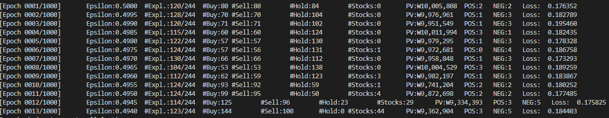
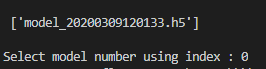
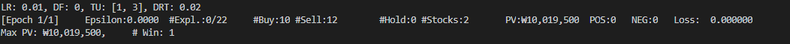

# 파이썬과 케라스를 이용한 강화학습 주식투자

## RL을 사용한 주식투자 구조

- Agent : 투자자
- Environment : (한 종목의) 차트 데이터
  - 2차원 데이터로 체결일(date), 시가(open), 고가(high), 저가(low), 종가(close), 거래량(volume)이 연속되는 식으로 구성된 데이터
- State
  - 주식 보유 비율 (현재 보유 주식 수 / 최대 보유 가능 주식 수)
  - 포트폴리오 가치 비율 (현재 포트폴리오 가치 / 기준 포트폴리오 가치)
- Action : 매수, 매도, 관망
- Reward : 손익

## RLTrader 구조

## Environment Setting

## Train

`python main.py --code <stock_code> --tax <y or n> --bal <balance> --reward <delayed_reward_threshold>`

- --code : 원하는 기업의 stock_code을 넣는다. 만약 해당 stock_code의 csv 파일을 가지고 있지 않으면 파일을 생성하며 가지고 있다면 어제 날짜까지 최신화하여 rewrite합니다. 
  - defaul = kospi

- --tax : 매매시 발생하는 거래세와 수수료를 고려하는지에 대한 여부를 나타냅니다.
  - default = n

- --bal : 학습시 초기 자금을 얼마로 할지 설정하는 option입니다.
  - default = 10000000
- --reward : 지연보상의 임계치를 설정하는 option입니다.
  - default = .02(2%)

학습하는 기간은 2018-01-01~2018-12-31이며 main.py의 60~61번 줄을 수정하여 바꿀 수 있습니다.

위와 같이 학습이 됩니다.

## Test

`python main_test.py --code <stock_code> --tax <y or n> --bal --reward <delayed_reward_threshold>`

Train과 같은 옵션을 가지고 있으며 해당 stock_code로 여러 model을 학습했을 수 있으므로 모델을 선택하는 화면으로 넘어 갑니다.

원하는 모델을 index로 선택을 하며 첫 model의 index는 0입니다.

1 epoch만큼 학습된 모델을 바탕으로 진행을 하며 다음과 같이 결과를 얻을 수 있습니다.

이 경우에는 19,500원의 수익을 얻었음을 알 수 있습니다.

## Visualizer

